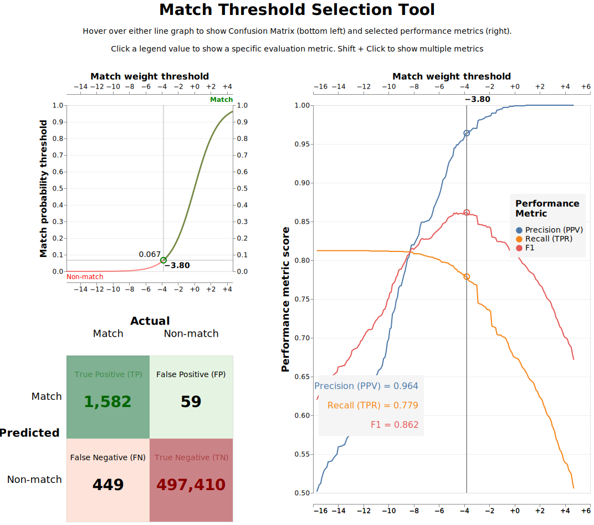

# Integration with splink package

In this example, we demonstrate how to integrate `BlockingPy` with the `Splink` package for probabilistic record linkage. `Splink` provides a powerful framework for entity resolution, and `BlockingPy` can enhance its performance by providing another blocking approach.
This example will show how to deduplicate the `fake_1000` dataset included with `Splink` using `BlockingPy` for the blocking phase improvement and `Splink` for the matching phase. We aim to follow the example available in the `Splink` documentation and modify the blocking procedure. The original can be foud [here](https://moj-analytical-services.github.io/splink/demos/examples/duckdb/accuracy_analysis_from_labels_column.html).

## Setup
First, we need to install `BlockingPy` and `Splink`:

```bash
pip install blockingpy splink
```

Import necessary components:

```python
from splink import splink_datasets, SettingsCreator, Linker, block_on, DuckDBAPI
import splink.comparison_library as cl
from blockingpy import Blocker
import pandas as pd
import numpy as np
np.random.seed(42)
```

## Data preparation
The `fake_1000` dataset contains 1000 records with personal information like names, dates of birth, and email addresses. The dataset consists of 251 unique entities (clusters), with each entity having one original record and various duplicates.

```python
df = splink_datasets.fake_1000
print(df.head(5))
#    unique_id first_name surname         dob    city                    email    cluster  
# 0          0     Robert    Alan  1971-06-24     NaN      robert255@smith.net          0
# 1          1     Robert   Allen  1971-05-24     NaN      roberta25@smith.net          0
# 2          2        Rob   Allen  1971-06-24  London      roberta25@smith.net          0
# 3          3     Robert    Alen  1971-06-24   Lonon                      NaN          0
# 4          4      Grace     NaN  1997-04-26    Hull  grace.kelly52@jones.com          1
```

For BlockingPy, we'll create a text field combining multiple columns to allow blocking on overall record similarity:

```python
df['txt'] = df['first_name'].fillna('') + ' ' + \
            df['surname'].fillna('') + \
            df['dob'].fillna('') + ' ' + \
            df['city'].fillna('') + ' ' + \
            df['email'].fillna('')   
```

## Blocking

Now we can obtain blocks from `BlockingPy`:

```python
blocker = Blocker()

res = blocker.block(
        x = df['txt'],
        ann='hnsw',
        random_seed=42,
)

print(res)
# ========================================================
# Blocking based on the hnsw method.
# Number of blocks: 252
# Number of columns used for blocking: 906
# Reduction ratio: 0.996306
# ========================================================
# Distribution of the size of the blocks:
# Block Size | Number of Blocks
#          2 | 62             
#          3 | 53             
#          4 | 51             
#          5 | 36             
#          6 | 26             
#          7 | 16             
#          8 | 7              
#          9 | 1     
print(res.result.head())
#      x  y  block      dist
# 0    1  0      0  0.142391
# 1    1  2      0  0.208361
# 2    2  3      0  0.230678
# 3    5  4      1  0.145114
# 4  814  6      2  0.584251
```

## Results integration

To integrate our results, we can add a `block` column to the original dataframe, which we can do by melting the blocking result and merging it with the original dataframe.

```python
result_df = res.result

mapping_df = (
    result_df
    .melt(id_vars=['block'], value_vars=['x', 'y'], value_name='record_id')
    .drop_duplicates(subset=['record_id'])
)

record_to_block = dict(zip(mapping_df['record_id'], mapping_df['block']))

df['block_pred'] = [record_to_block.get(i) for i in range(len(df))]
```

## Splink settings
Now we can configure and run `Splink` using our `BlockingPy` results. The following steps are adapted from the `Splink` documentation example:

```python
settings = SettingsCreator(
    link_type="dedupe_only",
    blocking_rules_to_generate_predictions=[
        block_on("block_pred"), # BlockingPy integration
        # block_on("first_name"),
        # block_on("surname"),
        # block_on("dob"),
        # block_on("email"),
    ],
    comparisons=[
        cl.ForenameSurnameComparison("first_name", "surname"),
        cl.DateOfBirthComparison(
            "dob",
            input_is_string=True,
        ),
        cl.ExactMatch("city").configure(term_frequency_adjustments=True),
        cl.EmailComparison("email"),
    ],
    retain_intermediate_calculation_columns=True,
)

db_api = DuckDBAPI()
linker = Linker(df, settings, db_api=db_api)
```
## Training the Splink model
Let's train the `Splink` model to learn the parameters for record comparison:

```python
deterministic_rules = [
    "l.first_name = r.first_name and levenshtein(r.dob, l.dob) <= 1",
    "l.surname = r.surname and levenshtein(r.dob, l.dob) <= 1",
    "l.first_name = r.first_name and levenshtein(r.surname, l.surname) <= 2",
    "l.email = r.email",
]

linker.training.estimate_probability_two_random_records_match(
    deterministic_rules, recall=0.7
)

linker.training.estimate_u_using_random_sampling(max_pairs=1e6, seed=5)

session_dob = linker.training.estimate_parameters_using_expectation_maximisation(
    block_on("dob"), estimate_without_term_frequencies=True
)
linker.training.estimate_parameters_using_expectation_maximisation(
    block_on("email"), estimate_without_term_frequencies=True
)
linker.training.estimate_parameters_using_expectation_maximisation(
    block_on("first_name", "surname"), estimate_without_term_frequencies=True
)
```
The above example shows how to inegrate `BlockingPy` with `Splink`. In the following section, we will compare several blocking approaches using this dataset.

## Comparing Different Blocking Strategies

We can compare three ways to handle blocking:

1. **Using only Splink** (from the original example)
2. **Using only BlockingPy**
3. **Combining both approaches**

To test these approaches, we simply modify the `block_on` parameters in `SettingsCreator` while keeping everything else the same. This lets us see how each blocking strategy affects match quality.

```python
# 1. BlockingPy only
blocking_rules_to_generate_predictions=[
        block_on("block_pred"),
],
# 2. Splink only
blocking_rules_to_generate_predictions=[
        block_on("first_name"),
        block_on("surname"),
        block_on("dob"),
        block_on("email"),
],
# 3. Splink + BlockingPy
blocking_rules_to_generate_predictions=[
        block_on("block_pred"),
        block_on("first_name"),
        block_on("surname"),
        block_on("dob"),
        block_on("email"),
],    
```
Ater training each model, we can evaluate the results using the `accuracy_analysis_from_labels_column` method from `Splink`, which will visialize the results. Below we present the results of the three models:

### BlockingPy only


### Splink only


### Splink + BlockingPy


## Conclusion

In this example, we demonstrated how to integrate `BlockingPy` with `Splink` for probabilistic record linkage. The comparsion between traditional methods, `BlockingPy` and the combination of both shows that when using both approaches we were able to significantly improve the performance metrics by capturing comparison pairs that would otherwise be missed. The integration allows for efficient blocking and accurate matching, making it a powerful combination for entity resolution tasks.

